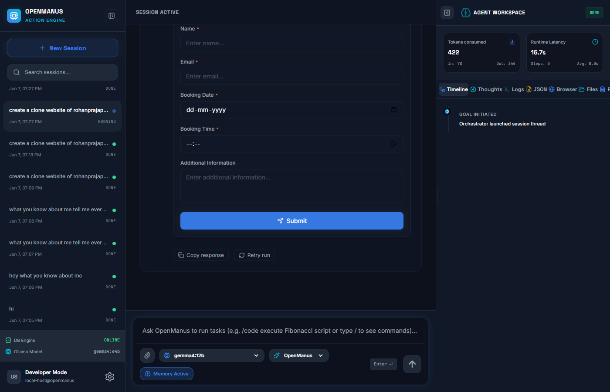
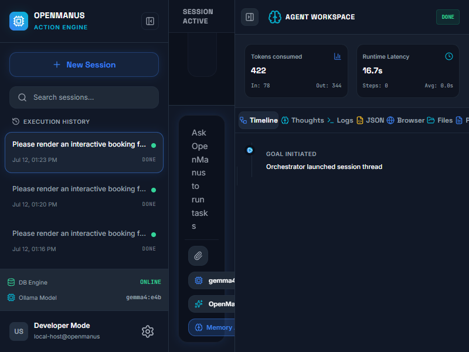

# 🤖 OpenManus — Local-First Autonomous AI Action Engine

[](https://opensource.org/licenses/MIT)
[](https://nodejs.org/)
[](https://www.postgresql.org/)
[](https://www.docker.com/)
[](https://react.dev/)
[](https://tailwindcss.com/)

An autonomous "action engine" clone of Manus AI. It reasons, writes code, runs scripts inside a secure Docker sandbox, and browses the web — with a **fully interactive remote control browser stream** letting you monitor and take control of the browser session in real time.

---

## 📸 Screenshots

### 1. Generative UI Interactive Booking Widget


### 2. Live Agent Session with Browser Remote Control Stream


---

## 🌟 Key Capabilities

### 🌐 1. Live Interactive Browser Remote Control
- **WebSocket Streaming:** JPEGs are captured from Puppeteer/Chromium, packed with frame-latency headers, and streamed to the frontend over binary WebSocket packets.
- **Client Backpressure Handling:** Frame drops occur instantly if the user's connection lags, keeping latency under **~150ms** (zero frame queuing).
- **Remote Control Input:** Click and scroll coordinate events map back to the Puppeteer tab, letting you directly guide or take over browser sessions.

### 🎭 2. 3 Specialized Agent Roles
Choose the best persona for the job in the chat selector:
- **`OpenManus` (Autonomous Orchestrator):** The default general-purpose planner that handles standard tasks, tool selection, and reasoning.
- **`CoderAgent` (Software Developer):** Focuses on code generation, script execution, environment resolution, and math/data tasks inside the Docker sandbox.
- **`BrowserAgent` (Web Researcher):** Optimizes search, web browsing, scraping, and remote interaction.

### 🔌 3. Multi-Provider AI Settings & Scraper
- **Ollama:** Run fully locally with local models like `qwen2.5:7b` or `gemma2`.
- **Groq & OpenAI:** High-speed cloud providers with automated model scraping and pricing detection.
- **Toggles & Configuration:** Enable/disable providers, customize base URLs, and add secret API keys straight from the Settings UI.

### 💾 4. Double-Source Configuration
- **`.env` Mode:** Reads API keys and variables directly from the local `.env` file (static developer config).
- **`Database` Mode:** Reads variables from the PostgreSQL `env_settings` table (dynamic user settings).
- Toggle between them in **Settings → Environments** to update values in real time without restarting the Node server.

### 🔒 5. Ephemeral Docker Sandbox
- Stage code safely! All code blocks (Python/JS/Shell) run inside isolated Docker containers.
- **Tar Injections:** Avoids volume mounts, pushing scripts into containers via tar streams.
- **Safety Caps:** 256MB memory quota, 50% CPU single-core limit, PID quota of 64, and a 30s hardware timeout constraint.

### 🧠 6. Long-Term Consolidated Memory
- Persistent agent memory backed by PostgreSQL.
- **Personalized Facts:** Remembers directories, coding habits, or credentials.
- **LLM Consolidation:** Periodically merges duplicate memories into a compact list to minimize context-window footprints.

### 📝 7. Context Compacting & AI Summary
- Configurable **Summarization Threshold** (in characters).
- Automatically compacts old messages when chat size exceeds the limit, maintaining the agent's core context window.

---

## 📁 Project Structure

```
openmanus/
├── schema.sql                   # DB Schema & seeded initial skills
├── docker-compose.yml           # Runs PostgreSQL + pgAdmin
├── package.json                 # Project dependencies & launch scripts
├── src/                         # Backend Engine
│   ├── index.js                 # API server, WS socket, and SSE endpoint
│   ├── agent.js                 # Core reasoning loops & prompt directives
│   ├── config.js                # Environment config resolver
│   ├── db.js                    # PostgreSQL client pools
│   ├── routes/
│   │   └── env.js               # REST CRUD for env settings (with key masking)
│   └── tools/
│       ├── docker.js            # Docker sandbox runtime
│       ├── browser.js           # Browser CDP session remote control
│       └── skills.js            # Skill CRUD
└── frontend/                    # Vite + React Client
    ├── src/
    │   ├── components/
    │   │   ├── EnvSettings.tsx  # DB config and provider toggle manager
    │   │   ├── BrowserPanel.tsx # WS remote canvas browser player
    │   │   └── Sidebar.tsx      # Panel routing & settings tabs
    │   └── store/
    │       └── useChatStore.ts  # Zustand global client store
    └── vite.config.ts
```

---

## 🛠️ Prerequisites

Make sure you have these installed:
- **Node.js** (version `20.x` or higher)
- **pnpm** package manager
- **PostgreSQL** running locally (or via Docker Compose)
- **Docker Desktop** (with "Expose daemon on tcp://localhost:2375" checked in settings on Windows)
- **Ollama** running at `http://localhost:11434` with your preferred model pulled (e.g. `ollama pull qwen2.5:7b`)

---

## 🚀 Quick Start

### 1. Database Setup (Docker Compose)
Run the pre-configured Postgres database container:
```bash
# Starts PostgreSQL (exposed on port 5432) and pgAdmin (on port 5050)
pnpm run docker:up
```
*Note: The schema is automatically applied and seeded with initial skills on first boot.*

### 2. Environment Variables
Copy the template and adjust values:
```bash
cp .env.example .env
```
Inside your `.env`, specify your database credentials:
```env
POSTGRES_HOST=localhost
POSTGRES_PORT=5432
POSTGRES_DB=openmanus
POSTGRES_USER=postgres
POSTGRES_PASSWORD=postgres
```

### 3. Install Dependencies
```bash
pnpm install
```

### 4. Install Browser Binary
Installs the headless Chrome binary needed for web browsing:
```bash
pnpm run browser:install
```

### 5. Launch the Platform
Start both the Express backend and Vite frontend concurrently in development mode:
```bash
pnpm run dev:all
```

- **Frontend client:** Visit [http://localhost:5173](http://localhost:5173) in your browser.
- **Backend API:** Exposed at [http://localhost:3000](http://localhost:3000).

---

## 🔌 API Reference

### `POST /run`
Starts an agent session. Returns a Server-Sent Events (SSE) stream of events.
- **Body:**
  ```json
  {
    "goal": "Write a python script to parse local date and print it.",
    "agent": "OpenManus",
    "model": "qwen2.5:7b",
    "summaryThreshold": 40000,
    "useMemory": true
  }
  ```

### `GET /models`
Scrapes and returns available models and their active enabled toggles.
- **Response:**
  ```json
  {
    "ollama": ["qwen2.5:7b", "gemma2"],
    "openai": [{"id": "gpt-4o", "name": "GPT-4o"}],
    "groq": [{"id": "llama-3.3-70b-versatile", "name": "Llama 3.3"}],
    "enabled": { "ollama": true, "groq": false, "openai": false }
  }
  ```

### `GET /env/settings` / `PUT /env/settings`
Read/Write keys stored in the PostgreSQL settings table. Secret fields are automatically masked.

---

## 📄 License
This project is open-source software licensed under the [MIT License](./LICENSE).
